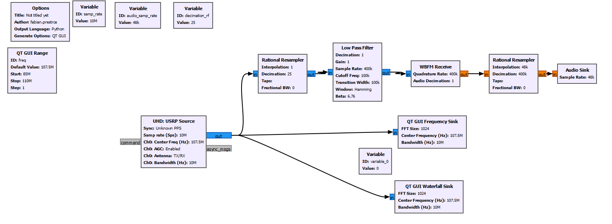
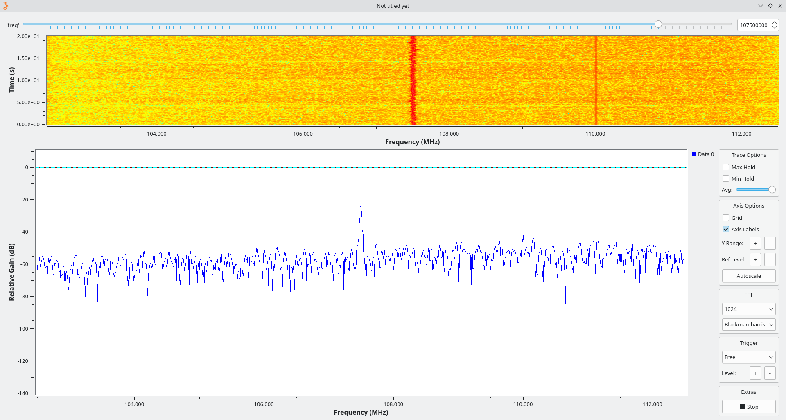
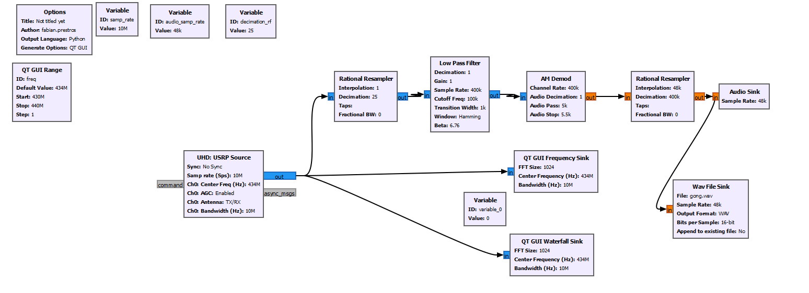
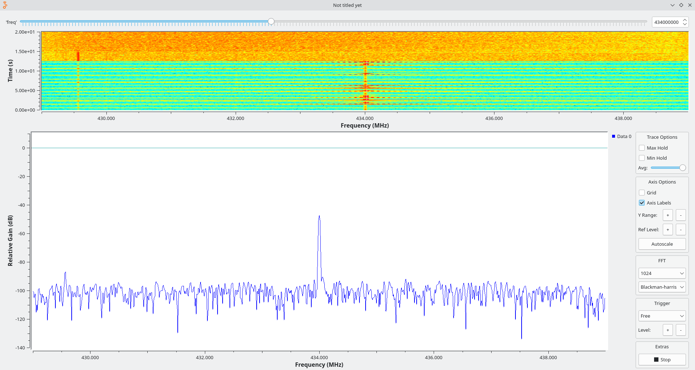
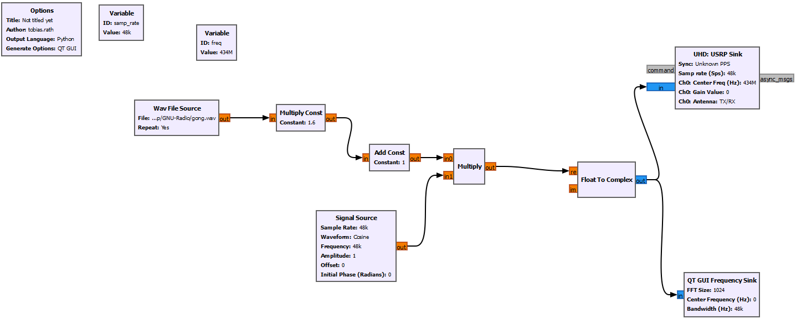

# KSN Projects
School project by Prestros Fabian, Rath Tobias and Rucker Josef

## funkR (FM Radio)

### Aufbau:

- **UHD USRP Source:** Dies ist die Signalquelle, die über ein USRP-Gerät läuft. Hier ist die Sample-Rate auf 10 Msps eingestellt, die Zentralfrequenz auf 107,5 MHz, und die Bandbreite auf 10 MHz. Auch hier ist die automatische Verstärkungsregelung (AGC) aktiviert.

- **QT GUI Range:** Diese Benutzeroberfläche ermöglicht es, die Zentralfrequenz des USRP-Gerätes anzupassen. Sie kann zwischen 85 MHz und 110 MHz variiert werden, mit einer Schrittweite von 1 MHz.

- **Rational Resampler:** Dieser Block ändert die Sample-Rate des eingehenden Signals, indem er das Signal um den Faktor 25 dezimiert, was bedeutet, dass die Rate der verarbeiteten Samples reduziert wird.

- **Low Pass Filter:** Ein Tiefpassfilter, der höhere Frequenzen abschneidet, um Interferenzen und Rauschen außerhalb des gewünschten Frequenzbands zu eliminieren. Hier ist er so eingestellt, dass er Signale über 100 kHz herausfiltert.

- **WBFM Receive:** Dieser Block ist spezifisch für die Verarbeitung von Breitband-FM-Signalen. Er demoduliert das Signal, das mit einer Rate von 400 kHz abgetastet wurde. Das Ergebnis ist ein demoduliertes Audiosignal, das für den menschlichen Gehörsinn wahrnehmbar ist.

- **Rational Resampler (nach dem WBFM Receive):** Wie im vorherigen Blockdiagramm wird auch hier das Signal weiter dezimiert, um die Sample-Rate auf 48 kHz zu reduzieren, was eine Standard-Audio-Sample-Rate ist.

- **Audio Sink:** Der Audio Sink gibt das verarbeitete Audiosignal an den Audioausgang des Computers zur akustischen Wiedergabe aus.

- **QT GUI Frequency Sink und QT GUI Waterfall Sink:** Diese grafischen Blöcke zeigen eine Echtzeit-Visualisierung des Frequenzspektrums (Frequency Sink) und des zeitabhängigen Spektrums (Waterfall Sink) des verarbeiteten Signals. Sie zeigen die Daten an, die durch das USRP-Gerät empfangen werden.

- **Variable:** Es gibt einen Variable-Block (variable_0), dessen Wert im Diagramm mit 0 angegeben ist. Dieser könnte als Platzhalter für spätere Konfigurationen oder Berechnungen dienen.

### Simulation/Ausgabe:

## FUNKGONG

### Aufbau:

- **UHD USRP Source:** Dieser Block ist die Quelle des Signals, normalerweise verbunden mit einem USRP (Universal Software Radio Peripheral) Gerät (ETTUS B200). Es ist konfiguriert, um ein Signal mit einer bestimmten Sample-Rate (10 Msps - Mega Samples per Second), einer Zentralfrequenz (434 MHz), und Bandbreite (10 MHz) zu erfassen. AGC (Automatic Gain Control) ist aktiviert, um die Signalstärke automatisch anzupassen.

- **QT GUI Range:** Dieser Block ist eine Benutzeroberfläche, die es dem Benutzer ermöglicht, einen Parameter, in diesem Fall die Frequenz, interaktiv anzupassen. Die Einstellungen erlauben eine Anpassung von 430 MHz bis 440 MHz in 1 MHz Schritten.

- **Rational Resampler:** Dieser Block ändert die Sampling-Rate des Signals durch Interpolation und Dezimierung, in diesem Fall wird das Signal durch 25 dezimiert, um die Anzahl der Samples pro Sekunde zu reduzieren, ohne die Information des Signals zu verändern.

- **Low Pass Filter:** Ein Tiefpassfilter, der Frequenzen über einer bestimmten Grenze abschneidet. Dieser ist hier eingestellt, um Frequenzen über 100 kHz abzuschneiden und benutzt ein Hamming-Fenster für die Filtergestaltung.

- **AM Demod:** Dieser Block demoduliert ein AM (Amplitudenmoduliertes) Signal. Es verwendet die vorher definierten Raten für das Audiosignal, um es auf eine hörbare Form zu bringen.

- **Rational Resampler (nach dem AM Demod):** Ein weiterer Resampling-Block, der das demodulierte Audiosignal auf eine niedrigere Sample-Rate (48 kHz) bringt, passend für die Audioausgabe.

- **Audio Sink:** Dieser Block gibt das verarbeitete Audiosignal an den Audioausgang des Computers zur akustischen Wiedergabe aus.

- **Wav File Sink:** Parallel dazu wird das Audiosignal auch in eine WAV-Datei (**gong.wav**) geschrieben. Es wird mit einer Sample-Rate von 48 kHz und einer Auflösung von 16 Bit pro Sample gespeichert.

- **QT GUI Frequency Sink und QT GUI Waterfall Sink:** Diese beiden Blöcke bieten eine visuelle Darstellung des verarbeiteten Signals. Der Frequency Sink zeigt ein Spektrum (FFT-Größe 1024) des Signals, während der Waterfall Sink eine Wasserfalldarstellung über die Zeit bietet. Beide nutzen die gleiche Zentralfrequenz und Bandbreite wie der USRP-Quellblock.

- **Variable:** Es gibt zwei Variable-Blöcke (**audio_samp_rate** und **decimation_rf**), die zur Konfiguration anderer Blöcke genutzt werden. Sie sind globale Parameter, die in mehreren Blöcken verwendet werden können.

### Simulation/Ausgabe:

## gong-tx

### Aufbau:

- **Wav File Source:** Dieser Block lädt eine Audiodatei (hier „gong.wav“) und gibt sie als Signal aus. Die Option „Repeat: Yes“ bedeutet, dass die Wiedergabe der Datei in einer Schleife erfolgt, also nach dem Ende sofort wieder von vorne beginnt.

- **Multiply Const:** Dieser Block multipliziert das Audiosignal mit einem konstanten Faktor, hier 1,6, was die Amplitude des Signals erhöht.

- **Add Const:** Dem Signal wird ein konstanter Wert hinzugefügt, in diesem Fall 1. Dies könnte dazu dienen, einen Gleichspannungsanteil (DC-Offset) hinzuzufügen.

- **Signal Source:** Erzeugt ein sinusförmiges Signal (Cosine Wave) mit einer Frequenz von 4 kHz und einer Amplitude von 1, das als Trägersignal dienen könnte.

- **Multiply:** Dieser Block multipliziert das sinusförmige Signal mit dem aus der WAV-Datei kommenden (und bereits modifizierten) Audiosignal. Dadurch entsteht ein amplitudenmoduliertes Signal.

- **Float To Complex:** Wandelt das amplitudenmodulierte Signal von einem Float- (also einem reellen) in ein komplexes Signal um, das für die Übertragung über SDR nötig ist.

- **UHD: USRP Sink:** Dieser Block sendet das verarbeitete Signal an ein SDR-Gerät zur Übertragung. Die Einstellungen für die Sample-Rate, die Zentralfrequenz und die Antenne sind entsprechend vorgegeben.

- **QT GUI Frequency Sink:** Ein visuelles Diagnosetool, das das Spektrum des übertragenen Signals zeigt. In diesem Fall wird kein Zentrum der Frequenz angezeigt, was darauf hinweist, dass es für visuelle Rückmeldung und keine spezifische Frequenzanalyse konfiguriert ist.
